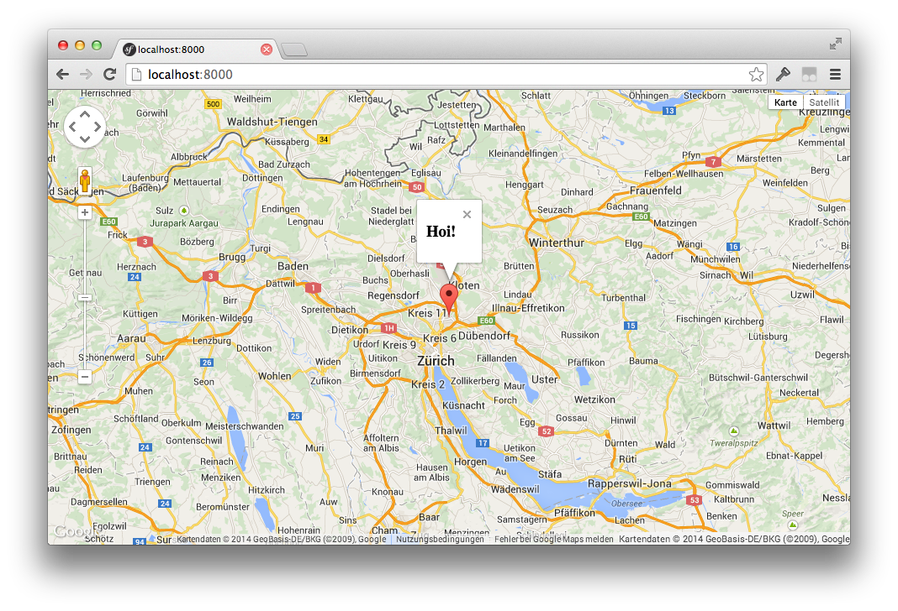
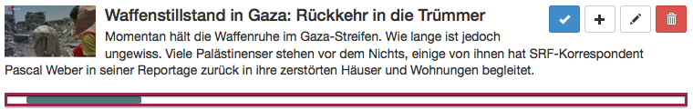

# Web Components for the Skeptic

---

# What are web components?

* Custom HTML element
* Widgets

---

# What do they look like?

```html
<fancy-card>
  <h3>Fridolin Frontend</h3>
  <p>Frontend developer</p>
</fancy-card>
```

---

# Independent, importable

```html
<link rel="import"
   href="components/fancy-card.html">
```

---

# Part of the HTML standard

at some point, hopefully...

---

# Extend other components

```html
<super-fancy-card>
  <h3>Fridolin Frontend</h3>
  <p>Frontend developer</p>
</super-fancy-card>
```

---

# Extend HTML elements

```html
<link rel="import"
   href="components/fancy-button.html">

<button is="fancy-button">Save</button>
```

---

# Should I care?

---

# Yes, because

* You have solved the "widget problem" in every project differently.
* There are a lot of libraries which solve it (jQuery UI, Angular JS directives, ...).
* Now comes the **HTML standard solution** for it.

---

# Yes, because

This future *has* to excite you:

1. Find nice and matching web component for your UI problem
2. Add it to your bower.json, install it
3. Import the element into your HTML
4. Use it in your HTML as it would be part of the HTML standard

---

# Yes, because

It will make your work easier, not harder. (Just a slight learning curve in the beginning, I promise ;)

---

# Yes, because

You can start **now**. (Github uses it already in production :)

---

# Example: Google maps

```html
<google-map latitude="37.779"
    longitude="-122.3892">
  <google-map-marker latitude="37.779"
      longitude="-122.3892">
    <h3>Hoi!</h3>
  </google-map-marker>
</google-map>
```

---



---

# Example: Voice recognition

```html
<voice-recognition id="recognition-element">

<script>
document.querySelector('#recognition-element')
  .addEventListener('result', function(e) {
    console.log(e.detail.result);
});
</script>
```

---

# Example: Resizing iframe

```html
<link rel="import" 
  href="components/resizing-iframe.html">

<iframe is="resizing-iframe"
  src="http://www.swisstxt.ch/sport-results">
</iframe>
```

---

# Browser support September 2014

* Chrome: Yep
* Firefox: Kind of
* Safari: Nope
* Internet Explorer: No way

---

# jQuery for web components

**Polyfill for web components**, which allow web components for most of the browsers we support.
Only exception is IE9 which works partly. (IE10+ is mostly fine).

=> Test early but chances are good it works.

https://github.com/Polymer/platform

---

# Libraries

* Polymer
* Mozilla Bricks
* X-Tags

---

# Polymer

http://www.polymer-project.org/

* Polyfill: platform.js
* data binding, layout attributes + some sugar
* core-elements
* paper-elements

---

# Let's start

---


---



---

# Segment represents interesting part of the movie

```html
<div class="timeline">
	<div class="timeline-segment">
</div>
```

---

# Setup

```bash
bower init

bower install --save Polymer/polymer

mkdir my-timeline
```

---

# index.html

```html
<html>
<head>
	<script src="bower_components/platform/platform.js"></script>
	<link rel="import" href="my-timeline/my-timeline.html">
    
</head>
<body>
	<my-timeline>
</body>
</html>
```

---

# my-timeline/my-timeline.html

```html
<link rel="import" href="../bower_components/polymer/polymer.html">

<polymer-element name="my-timeline">

  <template>
    <div>
		<div id="segment"></div>
	</div>
  </template>

  <script>
    Polymer('my-timeline')
  </script>

</polymer-element>

```

---

# <template>

HTML in template is implementation detail of component

## Shadow DOM

Not visible from "outside" DOM (light DOM).


---

# CSS for the element

```css
:host {
	border: 1px solid grey;
}
#segment {
	background-color: grey;
	display: block;
}
```
This CSS is not visible from outside. (Shadow DOM)

---

# Style elements from outside
```css
#my-timeline {
	border: 1px solid blue;
}
```

---

# How do I style the segment?

Shadow DOM is in general not stylable from outside. There are some non-standardized ways to "cross" into shadow DOM:

```css
#my-timeline {
	border: 1px solid blue;
}
#my-timeline::shadow #segment {
	background-color: red;
}
```

---

# Better: redesign element

```html
<style>
#my-timeline {
	border: 1px solid blue;
}
#my-timeline-segment {
	background-color: red;
}
</style>

<my-timeline>
	<my-timeline-segment>
</my-timeline>
```

---

# Attributes

```html
<my-timeline duration="10">
	<my-timeline-segment start="2" end="3">
</my-timeline>
```

---

# Attributes in JS

```html
<polymer-element name="my-timeline" attributes="duration">
  <script>
    Polymer('my-timeline', {
		duration: 5,
		durationChange: function() {
			// duration has changed
		}
	  	domReady: function() {
			// upgraded HTML elements are ready
	  	}
    });
  </script>
</polymer-element>
})
```

---

# Backend as HTML elements

```html
<my-backend-segment duration="{{duration}}">
<my-timeline duration="{{duration}}">
```
`my-backend-segment` encapsulates the backend API.

Polymer does the binding between the attributes of the elements: Setting duration in `<my-backend-segment>` triggers the JS function `durationChange()` in `<my-timeline>`.

---

# [fit] Doesn't this make sense?

---

# Starting points

* http://webcomponents.org/
* http://www.polymer-project.org/
* http://mozbrick.github.io/
* http://googlewebcomponents.github.io/
* http://component.kitchen/

---

# Thx.

